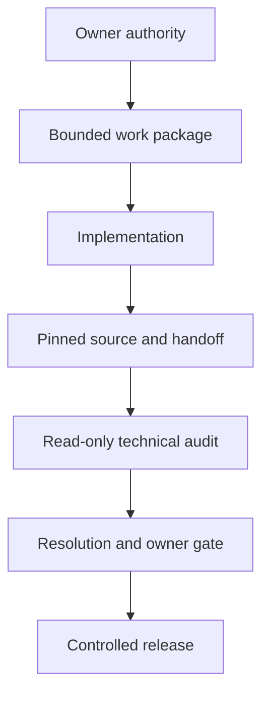

# Agentic Engineering Assurance System

[](https://doi.org/10.5281/zenodo.22019207)

<!-- public-claims: AUD-002 AUD-003 SYS-001 TST-001 -->

> **Governance, Auditability, and Release Integrity for AI-Assisted Software Engineering**

The Agentic Engineering Assurance System is a governed approach to long-running,
AI-assisted software delivery. It separates implementation, technical review,
human authority, evidence, and release so that important decisions remain
traceable after the conversation that produced them has ended.

This repository is the public technical system record. It explains the design,
the implemented control model, the recorded outcomes, and the known limits in a
form that can be reviewed without exposing the private operating environment or
its sealed evidence archive.

## Why it exists

AI agents can produce substantial engineering work, but speed alone does not
create assurance. Long-running work introduces practical risks:

- implementation and review can blur together;
- a reviewer can inspect a moving source tree;
- corrective work can introduce new defects;
- authority can become implicit in chat history;
- operational observations can be overstated as proof; and
- a release can become difficult to reconstruct later.

The system addresses these risks through explicit authority, exact source
checkpoints, a read-only audit role, bounded review rounds, durable decision
records, evidence-qualified claims, and controlled release.

## System at a glance



The owner defines objectives, acceptance criteria, continuation authority,
residual-risk decisions, and release approval. The implementation role changes
the system. The audit role inspects a pinned source position without modifying
it. Git provides the durable evidence surface connecting all three.

## Recorded outcomes

The sealed private evidence baseline supports the following public statements:

- seven audit reports were preserved across three governed reviews;
- one attempted round was explicitly recorded as not auditable;
- the six substantive audit rounds reported 33 findings: 11 HIGH and 22 MEDIUM,
  with no CRITICAL finding recorded;
- resolution records mark 32 findings as fixed and one as settled through an
  owner-ratified criteria revision;
- the final delivery review used two authorized rounds and reported eleven
  MEDIUM findings;
- three final-round findings were defects introduced by earlier corrective
  work; and
- the committed completion record reports 1,111 tests green in both the
  hermetic and explicit live-host tiers.

These statements are deliberately bounded. They describe retained records and
verified Git facts; they do not prove the absence of undiscovered defects or
constitute external certification.

## Engineering principles demonstrated

1. **A fix is a new change, not proof.** Corrective work receives the same
   skepticism as the original implementation.
2. **Evidence collection is not enforcement.** A signal only matters when the
   decision logic actually requires it.
3. **Fail-closed controls must run before side effects.** A late refusal is not
   a safe precondition.
4. **Tests must exercise real call shapes.** Simplified test vectors can miss
   production boundary failures.
5. **Approval is not release.** Risk acceptance, merge, tagging, deployment,
   and human-only observations remain distinct events.
6. **Limitations belong in the result.** Assurance becomes more credible when
   non-claims remain visible.

## Read the system record

| Document | Purpose |
| --- | --- |
| [System Overview](docs/01-system-overview.md) | Components, boundaries, and system behavior |
| [Implementation Record](docs/02-implementation-record.md) | What was delivered and what the audits changed |
| [Assurance Method](docs/03-assurance-method.md) | Authority, evidence, review, and claim discipline |
| [Public Evidence Index](docs/04-public-evidence-index.md) | Public claims and their evidence boundaries |
| [Limitations and Reassessment](docs/05-limitations-and-reassessment.md) | Known constraints and future triggers |
| [Independent Review](docs/06-independent-review.md) | Scope and status of third-party review |
| [References](docs/07-references.md) | External standards and platform mechanisms used by the public release process |
| [Publication Charter](PUBLICATION_CHARTER.md) | Public/private disclosure boundary |

Release and external-review materials are kept separate from the system
description:

| Package | Purpose |
| --- | --- |
| [Publication Gate](PUBLICATION_GATE.md) | Separate repository-deployment, Release, archival, and review gates |
| [Signing and Release](release/SIGNING_AND_RELEASE.md) | Signed commit, annotated tag, immutable release, and provenance process |
| [DOI and Archival](release/DOI_AND_ARCHIVAL.md) | Zenodo and persistent citation process |
| [Independent Review Brief](review/REVIEW_BRIEF.md) | Scope for a qualified external reviewer |
| [Assurance Statement Template](review/ASSURANCE_STATEMENT_TEMPLATE.md) | Required structure of the signed external conclusion |

## Evidence relationship

This public record derives from a sealed private baseline identified as
`PTE-2026-08-19-v1.0.1`. The baseline manifest is committed here only by its
SHA-256 digest:

```text
ecd87eb9581e535c95dee1beb0871fa5fc1382c9d3847eb5ebba337bc5ef827f
```

The digest is a commitment to a specific private manifest. It does not reveal
the manifest, independently validate its contents, or grant public access to
the underlying evidence.

## Professional accountability

**Ata Nasseri — System Designer and Assurance Owner**

Accountability included objectives, constraints, acceptance criteria,
authority boundaries, audit authorization, owner decisions, residual-risk
acceptance, and release governance. AI implementation and audit roles operated
within those human-defined boundaries.

## Assurance statement

This repository is evidence-backed but is not yet externally certified. The
independent-review package is prepared so that a qualified reviewer can assess
a precise signed release and publish a scoped assurance statement without
overstating what was examined.

## Use and citation

Documentation and visuals are licensed under CC BY-NC 4.0. Small software
utilities in this repository are licensed under Apache 2.0. See
[License](LICENSE.md), [Notice](NOTICE.md), and [Citation](CITATION.cff).

Persistent identifiers:

- Version `v1.0.0`: [10.5281/zenodo.22019208](https://doi.org/10.5281/zenodo.22019208)
- All versions: [10.5281/zenodo.22019207](https://doi.org/10.5281/zenodo.22019207)
