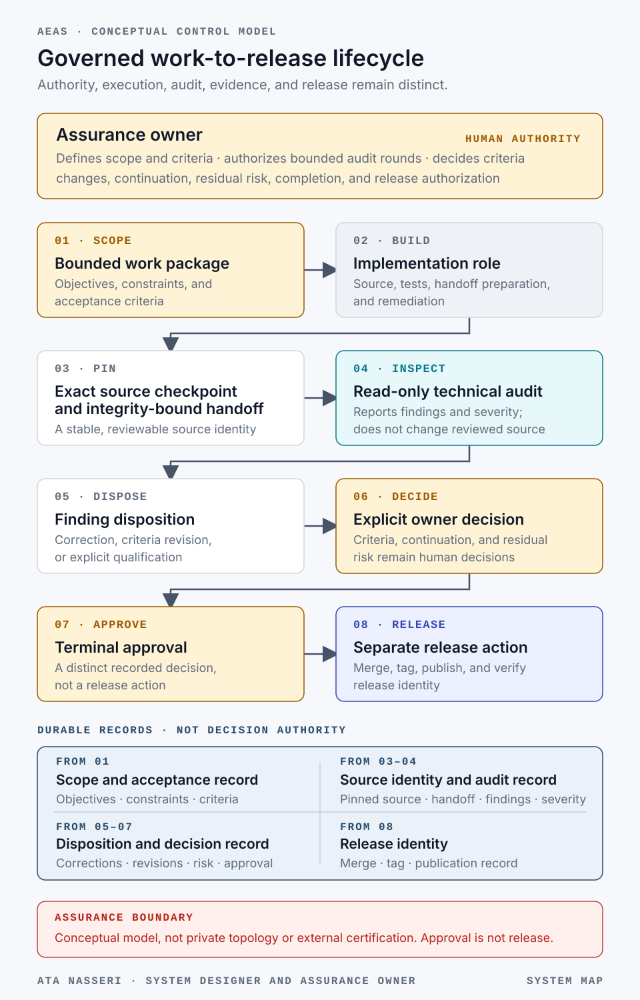
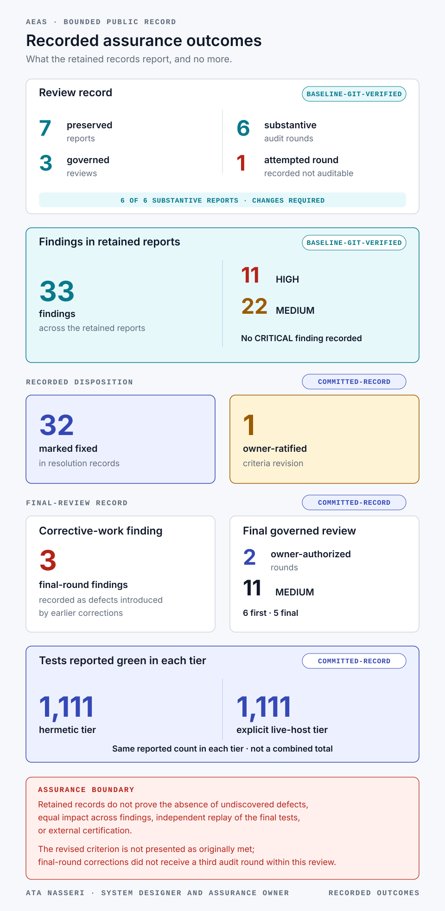
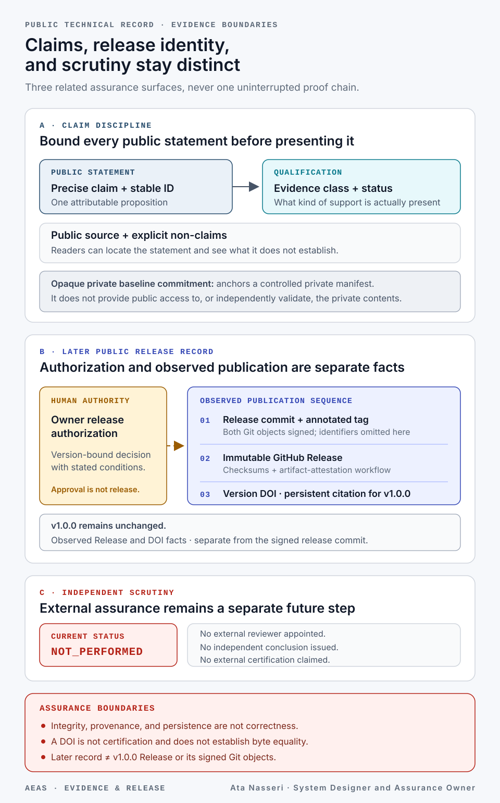

# Agentic Engineering Assurance System

[](https://doi.org/10.5281/zenodo.22019207)

<!-- public-claims: ARC-001 AUD-001 AUD-002 AUD-003 AUD-004 AUD-005 BND-001 GOV-001 GOV-002 REL-001 REL-003 REV-001 SYS-001 TST-001 -->

> **Governance, Auditability, and Release Integrity for AI-Assisted Software Engineering**

The Agentic Engineering Assurance System is a governed system for long-running,
AI-assisted software delivery. It keeps implementation, read-only technical
audit, human authority, evidence, and release distinct so that material
decisions remain attributable and reviewable after the conversation that
produced them has ended.

This repository is the bounded public technical record. It documents the
design, implemented control model, recorded outcomes, release evidence, and
known limitations without disclosing the private operating environment or its
sealed evidence archive.

## In 30 seconds

| Question | Short answer |
| --- | --- |
| **What is this?** | A governed system for long-running, AI-assisted software delivery, documented as a public technical record. |
| **What does it separate?** | Human authority, implementation, read-only technical audit, durable evidence, and release. |
| **How is it controlled?** | Bounded work packages, pinned source, explicit finding disposition, owner gates, and a separate release step. |
| **What can a reader inspect?** | [Public claims and their boundaries](docs/04-public-evidence-index.md), [Release v1.0.0](https://github.com/Atanasseri/agentic-engineering-assurance-system/releases/tag/v1.0.0), [publication metadata](evidence/publication.json), and the [version DOI](https://doi.org/10.5281/zenodo.22019208). |
| **Who is accountable?** | **Ata Nasseri, System Designer and Assurance Owner.** |
| **What is the current boundary?** | Evidence-backed and publicly released; independent technical review has not yet been performed, and no external certification is claimed. |

## Choose your reading path

| If you are… | Start here | Then inspect | Primary question answered |
| --- | --- | --- | --- |
| A product or system leader | This README and the [System Overview](docs/01-system-overview.md) | [Limitations and Reassessment](docs/05-limitations-and-reassessment.md) | What is governed, who decides, and where are the boundaries? |
| A technical reviewer | [Implementation Record](docs/02-implementation-record.md) | [Assurance Method](docs/03-assurance-method.md) and [Public Evidence Index](docs/04-public-evidence-index.md) | What was recorded, how was it reviewed, and how strong is each claim? |
| A risk, governance, or assurance reader | [Assurance Method](docs/03-assurance-method.md) | [Public Evidence Index](docs/04-public-evidence-index.md) and [Limitations](docs/05-limitations-and-reassessment.md) | Which decisions remain human, and what is explicitly not established? |
| A release or provenance specialist | [Current assurance status](#current-assurance-status) | [Signing and Release](release/SIGNING_AND_RELEASE.md), [publication metadata](evidence/publication.json), and [DOI guidance](release/DOI_AND_ARCHIVAL.md) | Which exact public object is citable, persistent, and integrity-bound? |
| A prospective independent reviewer | [Independent Review Brief](review/REVIEW_BRIEF.md) | [Review Checklist](review/REVIEW_CHECKLIST.md), [review status](docs/06-independent-review.md), and the immutable [`v1.0.0` GitHub Release](https://github.com/Atanasseri/agentic-engineering-assurance-system/releases/tag/v1.0.0) with its signed Git objects | What must be independently checked before any external conclusion is published? |

## Professional accountability

**Ata Nasseri, System Designer and Assurance Owner**

The accountable scope represented here includes translating objectives and
constraints into bounded acceptance criteria; defining authority boundaries;
authorizing audit rounds; deciding criteria changes and residual risk; and
governing release. AI implementation and audit roles operated within those
human-defined boundaries.

This describes accountable system and assurance leadership. It does not claim
sole authorship of every implementation artifact or independent certification
of one's own work.

## Why it exists

AI agents can produce substantial engineering work, but speed alone does not
create assurance. Long-running work introduces practical risks:

- implementation and review can blur together;
- a reviewer can inspect a moving source tree;
- corrective work can introduce new defects;
- authority can become implicit in chat history;
- operational observations can be overstated as proof; and
- a release can become difficult to reconstruct later.

The system addresses these risks through explicit authority, exact source
checkpoints, a read-only audit role, bounded review rounds, durable decision
records, evidence-qualified claims, and controlled release.

## System at a glance



[Open the full-size system map](assets/visuals/system-map.svg).

The owner defines objectives, acceptance criteria, continuation authority,
residual-risk decisions, and release approval. The implementation role changes
the system. The audit role inspects a pinned source position without modifying
it. Git provides the durable evidence surface connecting all three. In text,
the governed sequence is: bounded work package → implementation → exact source
checkpoint and integrity-bound handoff → read-only audit → finding disposition
→ owner decision → terminal approval → separate release action.

## Recorded outcomes



[Open the full-size recorded-outcomes visual](assets/visuals/recorded-outcomes.svg).

The sealed private evidence baseline supports the following public statements:

- seven audit reports were preserved across three governed reviews;
- one attempted round was explicitly recorded as not auditable;
- the six substantive audit rounds reported 33 findings: 11 HIGH and 22 MEDIUM,
  with no CRITICAL finding recorded;
- resolution records mark 32 findings as fixed and one as settled through an
  owner-ratified criteria revision;
- each of the six substantive audit reports recorded a changes-required
  verdict;
- the final delivery review used two authorized rounds and reported eleven
  MEDIUM findings;
- three final-round findings were defects introduced by earlier corrective
  work; and
- the committed completion record reports 1,111 tests green in both the
  hermetic and explicit live-host tiers.

These statements are deliberately bounded. They describe retained records and
verified Git facts; they do not prove the absence of undiscovered defects or
constitute external certification.

## Engineering principles demonstrated

1. **A fix is a new change, not proof.** Corrective work receives the same
   skepticism as the original implementation.
2. **Evidence collection is not enforcement.** A signal only matters when the
   decision logic actually requires it.
3. **Fail-closed controls must run before side effects.** A late refusal is not
   a safe precondition.
4. **Tests must exercise real call shapes.** Simplified test vectors can miss
   production boundary failures.
5. **Approval is not release.** Risk acceptance, merge, tagging, deployment,
   and human-only observations remain distinct events.
6. **Limitations belong in the result.** Assurance becomes more credible when
   non-claims remain visible.

## Read the system record

| Document | Purpose |
| --- | --- |
| [System Overview](docs/01-system-overview.md) | Components, boundaries, and system behavior |
| [Implementation Record](docs/02-implementation-record.md) | What was delivered and what the audits changed |
| [Assurance Method](docs/03-assurance-method.md) | Authority, evidence, review, and claim discipline |
| [Public Evidence Index](docs/04-public-evidence-index.md) | Public claims and their evidence boundaries |
| [Limitations and Reassessment](docs/05-limitations-and-reassessment.md) | Known constraints and future triggers |
| [Independent Review](docs/06-independent-review.md) | Scope and status of third-party review |
| [References](docs/07-references.md) | External standards and platform mechanisms used by the public release process |
| [Publication Charter](PUBLICATION_CHARTER.md) | Public/private disclosure boundary |
| [Visual System](assets/VISUAL_SYSTEM.md) | Semantic color, typography, connector, accessibility, and change-control rules for public visuals |
| [Visual Manifest](assets/visuals/manifest.json) | Machine-readable claims, sources, dimensions, non-claims, and approval status for every visual asset |

Release and external-review materials are kept separate from the system
description:

| Package | Purpose |
| --- | --- |
| [Publication Gate](PUBLICATION_GATE.md) | Separate repository-deployment, Release, archival, and review gates |
| [Signing and Release](release/SIGNING_AND_RELEASE.md) | Signed release commit, signed annotated tag, immutable GitHub Release, and provenance process |
| [DOI and Archival](release/DOI_AND_ARCHIVAL.md) | Zenodo and persistent citation process |
| [Independent Review Brief](review/REVIEW_BRIEF.md) | Scope for a qualified external reviewer |
| [Independent Review Checklist](review/REVIEW_CHECKLIST.md) | Evidence, identity, method, and conclusion checks for the reviewer |
| [Independent Technical Review Statement Template](review/ASSURANCE_STATEMENT_TEMPLATE.md) | Required structure of the signed external conclusion |

## Evidence and release chain



[Open the full-size evidence-and-release visual](assets/visuals/evidence-release-chain.svg).

The visual deliberately shows three separate groups rather than one unbroken
proof chain:

1. a public claim is bounded by its identifier, evidence class, source, and
   explicit non-claims;
2. the later publication record identifies the signed release commit and
   signed annotated tag for `v1.0.0`, the immutable GitHub Release, checksums
   and provenance workflow, and persistent version DOI without changing those
   released objects; and
3. independent scrutiny remains `NOT_PERFORMED` until a qualified reviewer
   publishes a scoped conclusion under their own control.

## Private evidence relationship

This public record derives from a sealed private baseline identified as
`PTE-2026-08-19-v1.0.1`. The baseline manifest is committed here only by its
SHA-256 digest:

```text
ecd87eb9581e535c95dee1beb0871fa5fc1382c9d3847eb5ebba337bc5ef827f
```

The digest is a commitment to a specific private manifest. It does not reveal
the manifest, independently validate its contents, or grant public access to
the underlying evidence.

## Current assurance status

Release `v1.0.0` has verified signed Git objects and an immutable GitHub
Release. Its release assets have SHA-256 checksums and GitHub artifact
attestations; Zenodo provides a separate persistent version DOI. Independent
technical review has not yet been performed, and no external certification is
claimed. The [independent-review package](review/REVIEW_BRIEF.md) is prepared
so that a qualified reviewer can assess that precise release commit, signed
annotated tag, and immutable GitHub Release, then publish a scoped conclusion
tied to them.

The immutable `v1.0.0` GitHub Release remains the citable release object, bound
to a signed release commit and signed annotated tag. The default branch
contains later publication-record and documentation refinements; they do not
alter those signed Git objects, the Release assets, or the DOI.

## Use and citation

Documentation and visuals are licensed under CC BY-NC 4.0. Small software
utilities in this repository are licensed under Apache 2.0. See
[License](LICENSE.md), [Notice](NOTICE.md), and [Citation](CITATION.cff).

Persistent identifiers:

- Version `v1.0.0`: [10.5281/zenodo.22019208](https://doi.org/10.5281/zenodo.22019208)
- All versions: [10.5281/zenodo.22019207](https://doi.org/10.5281/zenodo.22019207)
