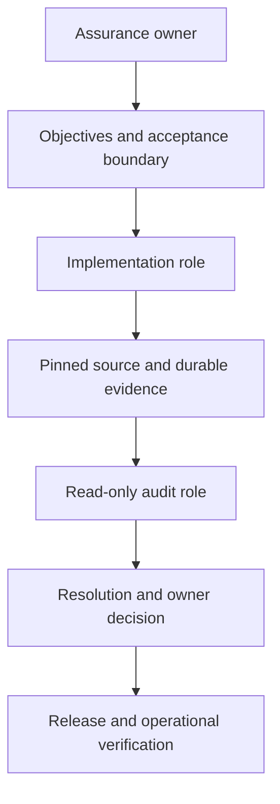
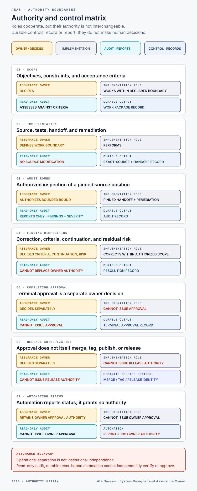

# System Overview

<!-- public-claims: BND-001 GOV-001 REL-001 SYS-001 -->

## Purpose

The Agentic Engineering Assurance System provides a controlled way to conduct
long-running, AI-assisted software engineering while keeping five concerns
distinct:

1. implementation;
2. technical audit;
3. human authority;
4. durable evidence; and
5. release.

The system does not try to remove human judgment. It makes that judgment
explicit, attributable, and reviewable.

## Operating model

The implementation role can change the product. The audit role receives an
exact source position and reports findings without modifying that source. The
owner alone may revise criteria, authorize continuation, accept residual risk,
approve completion, or authorize release.

## Core components

| Component | Responsibility | Assurance value |
| --- | --- | --- |
| Assurance owner | Scope, criteria, authority, risk, approval, and release | Keeps consequential decisions human and attributable |
| Work package | One bounded, independently reviewable outcome | Prevents scope from drifting silently |
| Implementation role | Code, tests, handoff, and remediation | Makes delivery accountable to declared criteria |
| Read-only audit role | Inspection of a pinned source state | Separates finding creation from implementation |
| Git evidence surface | Source identity, durable records, comparisons, and tags | Preserves what was reviewed and released |
| Review workflow | State, envelope, integrity, disposition, and round controls | Prevents unbounded or ambiguous review transitions |
| Persistent project runtime | Long-running engineering sessions | Supports continuity without treating liveness as proof of readiness |
| Recovery record | Exact state needed after interruption | Reduces reliance on conversational memory |

## Authority boundaries

[Open the full-size authority matrix](../assets/visuals/authority-matrix.svg).

| Governed action | Assurance owner | Implementation role | Read-only audit role | Durable output or control |
| --- | --- | --- | --- | --- |
| Objectives, constraints, and criteria | **Decides** | Works within the boundary | Assesses against the boundary | Bounded work package |
| Source, tests, handoff, and remediation | Defines the boundary | **Performs** the change | **No source modification** | Exact-source checkpoint and handoff |
| Audit round | **Authorizes** the round | Supplies pinned handoff and remediation | **Reports only** findings and severity | Audit record tied to exact source |
| Finding disposition | **Decides** criteria, continuation, and risk | Corrects or records response | Cannot substitute for owner authority | Resolution and decision record |
| Completion approval | **Decides separately** | Cannot issue owner approval | Cannot issue owner approval | Terminal approval record |
| Release authorization | **Decides separately** | Cannot issue release authority | Cannot issue release authority | Separate merge, tag, and release identity |
| Automation status | Retains owner approval authority | Cannot issue owner approval | Cannot issue owner approval | Automation **reports status and cannot issue owner authority** |

Operational separation is not the same as institutional independence. The
audit role is technically separated and read-only inside the designed
workflow; it is not an external certification body.

## Review lifecycle

The system follows a bounded lifecycle:

1. define a work package and acceptance criteria;
2. implement and test the bounded outcome;
3. pin the source and prepare a handoff;
4. run an authorized read-only audit;
5. disposition every finding;
6. obtain owner authority where continuation, criteria, or risk changes;
7. record terminal approval separately from release; and
8. merge, tag, and verify release identity through a distinct release step.

Review rounds are intentionally bounded. This prevents an open-ended loop, but
it also creates a visible limit: final-round remediation is supported by tests,
invariants, resolution evidence, and owner risk acceptance rather than an
unauthorized additional round.

## Readiness model

The implemented system distinguishes process liveness from operational
connection. It records staged readiness rather than treating a running process
as sufficient evidence.

The public record intentionally omits environment-specific state names,
identifiers, commands, and topology. The material design principle is that a
connected state requires more than one compatible indicator, while human-only
application visibility remains a separate observation.

## What the system is not

It is not:

- an external certification;
- a proof that no defect remains;
- a cryptographic attestation of every runtime observation;
- full per-project operating-system isolation;
- a general filesystem sandbox;
- a guarantee that an existing session is responsive; or
- a replacement for accountable owner judgment.
