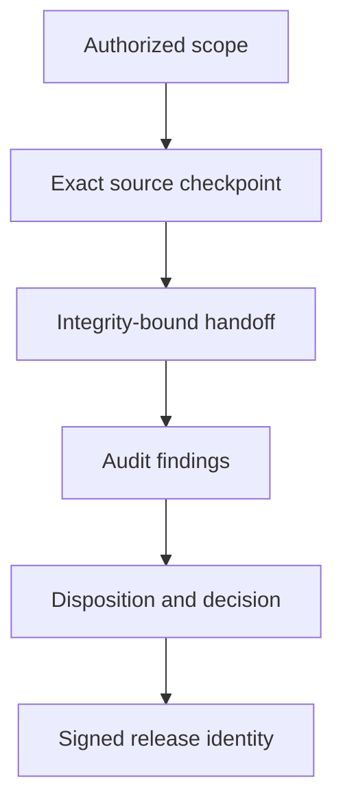

# Assurance Method

<!-- public-claims: GOV-001 GOV-002 REL-001 -->

## Objective

The assurance method makes technical work reviewable without collapsing design,
implementation, audit, owner authority, and release into one undifferentiated
activity.

## Four authority domains

| Domain | Primary authority | Durable output |
| --- | --- | --- |
| Scope | Assurance owner | Objectives, constraints, and acceptance criteria |
| Implementation | Implementation role | Source, tests, and handoff |
| Technical audit | Read-only audit role | Findings and severity |
| Risk and release | Assurance owner | Decisions, approval, and release authority |

The roles cooperate, but their authority is not interchangeable. An
implementation agent cannot issue owner authority. An audit agent cannot change
the reviewed source. Approval does not itself merge or release anything.

## Evidence chain

Each link establishes a different fact. The chain is credible only when those
differences remain visible.

## Public evidence classes

| Class | Meaning |
| --- | --- |
| `DIGEST-ANCHORED` | A public statement is linked to a sealed private manifest by an opaque cryptographic commitment. |
| `BASELINE-GIT-VERIFIED` | A Git identity, count, or comparison was directly established against pinned objects in the sealed private baseline; it is not independently public proof. |
| `COMMITTED-RECORD` | A committed source record reports the outcome; the public repository did not independently replay it. |
| `OWNER-CONFIRMED` | The owner directly observed a fact that local tooling could not establish. |
| `DESIGN-CONTRACT` | The documented design requires a property; the requirement is not by itself runtime proof. |
| `LIMITATION` | A known boundary narrows what may be claimed. |

`DIGEST-ANCHORED` does not reveal or independently validate the private source.
It enables a later authorized reviewer to confirm that the disclosed evidence
matches the previously committed private baseline.

## Claim discipline

Every material claim in `evidence/public-claims.json` includes:

- a stable public claim identifier;
- a precise statement;
- its evidence class;
- its support status;
- a public source reference; and
- explicit non-claims.

The local verifier checks this structure, checks source markers, and scans the
publication for prohibited locators and sensitive patterns. The publisher also
runs a private, uncommitted deny-list during final preflight. Automation
supports editorial discipline; it does not replace human privacy, legal, or
technical review.

## Finding disposition

Every finding requires an explicit outcome. A criteria revision is preserved
as a criteria revision rather than rewritten as if the original requirement
had always been met.

The public record intentionally distinguishes:

- a finding reported by the auditor;
- a correction recorded by the implementation process;
- an owner decision changing a criterion;
- a residual risk accepted at approval; and
- a later release action.

## Bounded review

The final workflow permitted exactly two authorized audit rounds. This kept the
review finite and owner-governed. It also meant final-round corrections could
not trigger an unauthorized third round within the same review.

The resulting assurance boundary is explicit: final corrections rely on tests,
existing invariants, resolution evidence, and owner risk acceptance. A future
release may open a new review rather than treating prior approval as permanent.

## Public release assurance

The public system record adds a separate assurance layer:

1. clean public history;
2. allow-list derivation;
3. prohibited-content scan;
4. machine-readable claims;
5. signed commit and annotated tag;
6. immutable GitHub release;
7. SHA-256 release manifest;
8. GitHub artifact attestation;
9. DOI-backed archival; and
10. an external review statement tied to the exact release.

No individual control is presented as certification. Together they strengthen
identity, integrity, provenance, persistence, and independent scrutiny.
